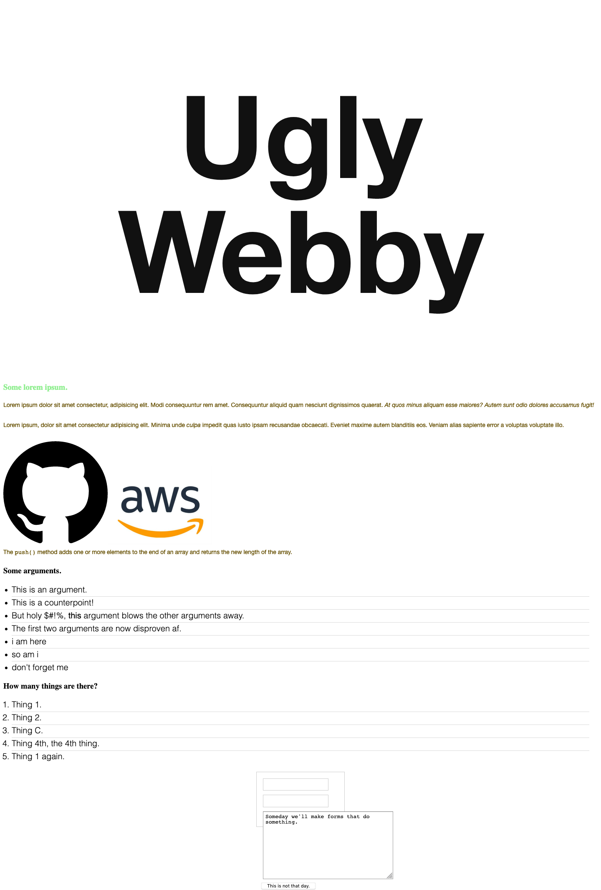

# what-i-learned-in-week-5

## DOM manipulation

Document object model - "It represents the page so that programs can change the document structure, style, and content."(from MDN)

I learned how to use javascript to manipulate the way a web page appears.

Example:
``` const h1 = document.querySelector('h1')
    h1.style.color = 'red'
```
### Tools

* `querySelector`
* `querySelectorAll`
* `getAttribute`
* `setAttribute`
* `appendChild`

---

## Projects

### Ugly query

This project was to use javascript to manipulate the DOM and make the site as ugly as possible.

*Find code here:* https://github.com/phenix1229/ugly-query

*See results here:* https://phenix1229.github.io/ugly-query

### Domb and Domber

This object of this project was to create javascript functions to use to manipulate the DOM (abstraction).

*Find code here:* https://github.com/phenix1229/domb-and-domber

*See results here:* https://phenix1229.github.io/domg-and-domber

---

## Miscellaneous

* Revisited CSS diner
* Overview of APIs
* New acronyms:
    * AHA - avoid hasty abstractions
    * WET - write everything twice
    * DRY - don't repeat yourself

---

## Challenges

I had some struggles with finding the right selector to make some of the changes or functions. I had to go through lots of trial and error. Particularly, with the Domb and Domber project where I had to step away for a while. This reinforced the lesson that sometimes a break is needed in order to think more clearly and find the solution.

---